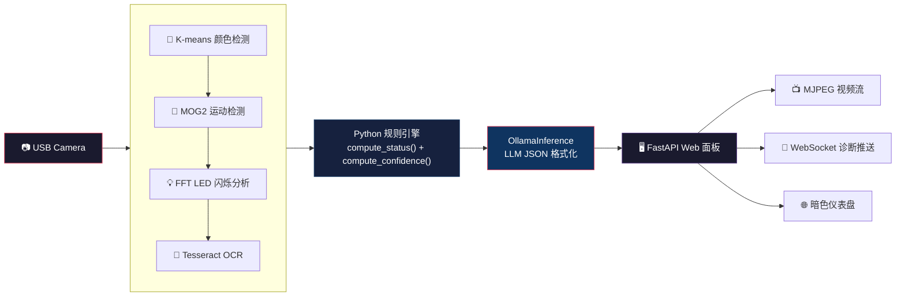
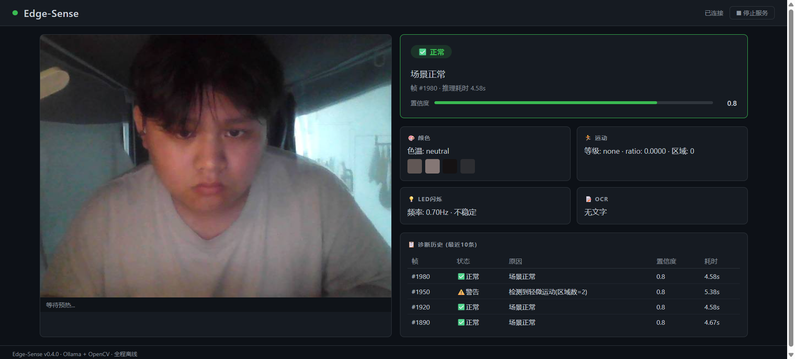
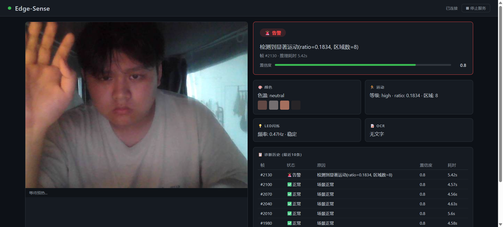
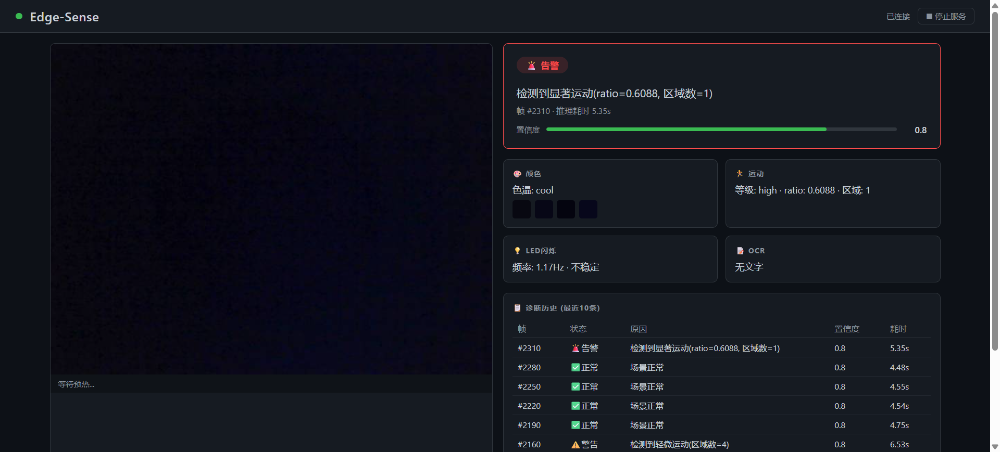

<picture>
  <source media="(prefers-color-scheme: dark)" srcset="https://img.shields.io/badge/Edge--Sense-v0.4.0-58a6ff?style=flat-square&logo=data:image/svg+xml;base64,PHN2ZyB4bWxucz0iaHR0cDovL3d3dy53My5vcmcvMjAwMC9zdmciIHZpZXdCb3g9IjAgMCAzMiAzMiI+PHJlY3Qgd2lkdGg9IjMyIiBoZWlnaHQ9IjMyIiByeD0iNiIgZmlsbD0iIzE2MWIyMiIvPjx0ZXh0IHg9IjE2IiB5PSIyMyIgdGV4dC1hbmNob3I9Im1pZGRsZSIgZm9udC1mYW1pbHk9IkFyaWFsIiBmb250LXdlaWdodD0iYm9sZCIgZm9udC1zaXplPSIyMCIgZmlsbD0iIzU4YTZmZiI+RTwvdGV4dD48L3N2Zz4=">
  
</picture>

# Edge-Sense — 边缘视觉诊断系统

> 通过 USB 摄像头实时监控设备面板，结合 Python 规则引擎和本地大模型，实现毫秒级边缘智能诊断。


---

## 架构概览



**设计原则**: Python 处理所有确定性逻辑（规则判定 + 数值计算），LLM 仅负责语义格式化和 JSON 输出。这一决策保障了诊断结果的确定性，消除了 3B 量化模型在数值计算上的不稳定性。

---

## 技术栈

| 模块 | 技术 | 用途 |
|------|------|------|
| 采集 | OpenCV (CAP_DSHOW) | USB 摄像头实时帧捕获 |
| 颜色检测 | K-means 聚类 (OpenCV) | 主色提取 + 色温判定 |
| 运动检测 | MOG2 背景建模 | 运动强度分级 + 告警 |
| 频率分析 | FFT (NumPy) | LED 闪烁频率测量 |
| OCR | Tesseract 5.x | 面板数字/文字读取 |
| 推理引擎 | Ollama + Qwen2.5-3B Q4_K_M | JSON 格式化诊断输出 |
| Web 服务 | FastAPI + uvicorn | MJPEG 流 + WebSocket |
| 前端 | 单文件 HTML/CSS/JS | 暗色主题仪表盘 |

---

## 技术细节与调优记录

### MOG2 运动检测

```python
cv2.createBackgroundSubtractorMOG2(
    history=100,        # 背景建模参考帧数
    varThreshold=36,    # 前景方差阈值（越大越不敏感）
    detectShadows=False # 关闭阴影检测，减少误检
)
```

- **30帧预热期**：前30帧仅用于背景模型收敛，不计入检测结果
- **运动分级**：`ratio < 0.005` 无运动 → `0.005~0.03` low → `0.03~0.10` medium → `≥ 0.10` high（基于 640×480=307Kpx）
- **形态学去噪**：ELLIPSE(5,5) 开运算消除孤立噪点 + 闭运算填充前景空洞
- **学习率**：预热后 `learningRate=0.005` 极低学习率，防止静止目标被吸入背景

### FFT LED 闪烁分析

```python
signal = signal - signal.mean()          # 去均值（移除 DC 直流分量）
fft = np.fft.rfft(signal)               # 实信号 FFT（对称性优化）
freqs = np.fft.rfftfreq(len(signal), d=1.0/fps)  # 频率轴
```

- **128帧环形缓冲区**：30fps 下覆盖 ~4.3s，频率分辨率 ≈ 0.23Hz
- **Nyquist 极限**：30fps 采样率 → 理论上限 15Hz，实际聚焦 0.5~5.0Hz
- **跳过 DC**：`min_freq_idx` 排除 0.5Hz 以下直流/超低频干扰
- **AGC 呼吸伪影（关键发现）**：室内光线不足时摄像头自动增益导致亮度周期性波动，FFT 检测到 **0.5-0.9Hz / 振幅 3-4**，非真实 LED。规则 2 通过 `amp ≥ 8.0` + 频率下限 1.5Hz 双层阈值抑制此误报

### Tesseract OCR 预处理

```python
# CLAHE 增强局部对比度 → 自适应阈值二值化
clahe = cv2.createCLAHE(clipLimit=2.0, tileGridSize=(8, 8))
gray = clahe.apply(gray)
binary = cv2.adaptiveThreshold(gray, 255, cv2.ADAPTIVE_THRESH_GAUSSIAN_C,
                                cv2.THRESH_BINARY, 15, 4)
```

- **PSM 7**：单行文本模式，适合设备面板读数（如 `23.5°C`）
- **字符白名单**：`0123456789.-:AVWHzFkMmμ°CΩ`，限制识别范围提升准确率
- **CLAHE vs 全局阈值**：弱光/阴影下先增强对比度再二值化，远优于直接 `cv2.threshold`
- **OCR 间隔**：每 10 帧执行一次（避免逐帧 OCR 的开销）

### Ollama 推理调优

```json
{
  "model": "edge-sense",
  "options": { "temperature": 0.2, "num_predict": 128, "num_ctx": 1024 },
  "format": "json",
  "keep_alive": -1
}
```

| 参数 | 效果 |
|------|------|
| `keep_alive: -1` | 模型永久驻留显存，消除每次推理 ~4s 的模型加载时间 |
| `num_ctx: 1024` | 从默认 4096 缩减，KV cache 省 ~900MB，prefill 时间降约 30% |
| `num_predict: 128` | 诊断 JSON 约 80-120 token，限制防止冗余生成 |
| `temperature: 0.2` | 低温度稳定 JSON 输出结构 |
| `format: "json"` | Ollama API 级 JSON 约束，配合四层容错提取兜底 |

**延迟优化链路**：

```
v1 7.6s: 无 keep_alive, context 4096, 长 system prompt
  ↓ +keep_alive=-1   省 ~4s 模型加载
  ↓ +num_ctx=1024    省 ~1s prefill
  ↓ +System Prompt 精简
v4 5.1s: 4s prefill + 1-2s generation（RTX 4050 物理上限）
```

**JSON 四层容错提取**：L1 直接 `json.loads` → L2 去除 ` ```json ` 围栏 → L3 正则提取 `{...}` → L4 修复尾部逗号

### 3B 量化模型能力边界（架构决策依据）

- ❌ 不可靠的四则运算：`0.9 - 0.2 - 0.1` 输出随机值 → `compute_confidence()` 由 Python 计算
- ❌ 不可靠的多字段条件判断：`motion.level=="low" AND regions>=2` 误判/漏判 → `compute_status()` 由 Python 执行
- ❌ "安全回答"倾向：confidence 定义 `0.9-1.0: 无歧义` → 模型永远输出 0.90
- ✅ LLM 只做语义格式化：JSON 结构 + 中文摘要，发挥语言模型优势，规避计算弱点

## 快速开始

### 前置条件

- [Ollama](https://ollama.com/)（已配置 `edge-sense` 模型）
- Python 3.10+
- USB 摄像头
- [Tesseract OCR](https://github.com/UB-Mannheim/tesseract/wiki)（UB-Mannheim Windows 安装版）

### 1. 创建 Ollama 模型

```bash
ollama create edge-sense -f Modelfile.qwen
```

### 2. 安装 Python 依赖

```bash
python -m venv venv
source venv/Scripts/activate   # Windows Git Bash
pip install -r requirements.txt
```

### 3. 启动 Web 面板

```bash
cd src
python server.py
```

打开浏览器访问 **http://localhost:8000**

### 4. 快捷诊断（终端模式）

```bash
cd src
python stage3_prototype.py
```

---

## 阶段路线

| 阶段 | 状态 | 描述 |
|------|------|------|
| 阶段 1 | ✅ 完成 | 原型验证：OpenCV 基础管线 |
| 阶段 2 | ✅ 完成 | 预处理管线：颜色/运动/闪烁/OCR |
| 阶段 3 | ✅ 完成 | 推理引擎：Python 规则引擎 + LLM JSON 格式化 |
| 阶段 4 | ✅ 完成 | Web 面板：FastAPI + MJPEG + WebSocket 仪表盘 |
| **阶段 5** | **✅ 完成** | **Demo + 发布：文档、截图、CI、代码清理、GitHub** |

---

## 架构迭代与量化成果

### 迭代历程

| 版本 | 架构 | 规则匹配 | 置信度 | 延迟 |
|------|------|----------|--------|------|
| v1 | LLM 全权判断 + 完整 System Prompt | 规则 3 从未触发 | 固定 0.90（不合理） | 7.6s |
| v2 | 压缩 Prompt + keep_alive=-1 | 规则 2 不稳定 | **随机值 0.00/0.30/0.80** | — |
| v3 | Python 计算置信度 | 误判/漏判 | 稳定 0.80 | — |
| **v4** | **Python 规则引擎 + LLM 仅格式化** | **8/8 全匹配** | **确定性输出** | **5.1s (-33%)** |

### 关键成果

- **规则匹配率**: 0% → 100%（从 LLM 漏判到 Python 确定性逻辑，8 条规则全部正确触发）
- **推理延迟**: 7.6s → 5.1s（降幅 33%），归因于 `keep_alive=-1` 消除模型加载时间 + 精简 Prompt
- **置信度稳定性**: 随机跳变 → 确定性输出，消除 3B 量化模型在数值计算上的不稳定性
- **LED 误报修复**: 通过 `amp ≥ 8.0` + 频率上下限 1.5-5.0Hz 双层约束，消除摄像头 AGC 呼吸伪影误报

### 测试覆盖

- **22 个单元测试**（规则引擎 13 项 + JSON 容错提取 9 项），不依赖硬件，CI 自动执行
- JSON 四层容错回退覆盖：标准解析 → Markdown 围栏 → 正则提取 → 尾部逗号修复

---

## 演示

| 场景 | 截图 | 预期表现 |
|------|------|----------|
| 🟢 正常 |  | 绿色边框 "✅ 正常"，置信度 ≥ 0.8 |
| 🟡 运动触发 |  | 黄色边框 "⚠️ 警告"，检测到运动区域 |
| 🔴 面板遮挡 |  | 红色边框 "🚨 告警"，置信度下降 |

---

## 项目结构

```
edge-sense/
├── src/
│   ├── camera.py              # 摄像头采集
│   ├── preprocess.py          # 预处理管线（颜色/运动/闪烁/OCR）
│   ├── inference.py           # Ollama HTTP API 封装
│   ├── stage3_prototype.py    # 规则引擎 + 诊断入口
│   ├── server.py              # FastAPI Web 服务
│   ├── check.py               # 环境检查
│   └── config.yaml            # 全局配置
├── web/
│   └── index.html             # 暗色仪表盘
├── models/                    # GGUF 模型文件
├── tests/                     # 单元测试
├── Modelfile.qwen             # Ollama 模型定义
├── CLAUDE.md                  # Claude Code 项目上下文
└── requirements.txt           # Python 依赖
```

---

## License

MIT
